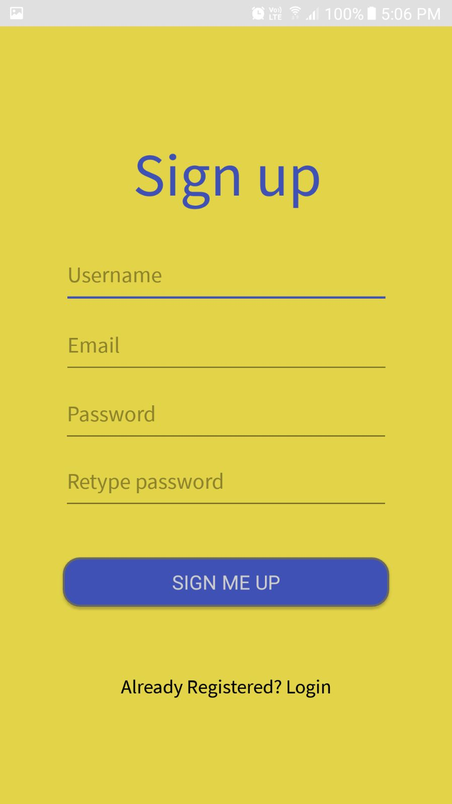
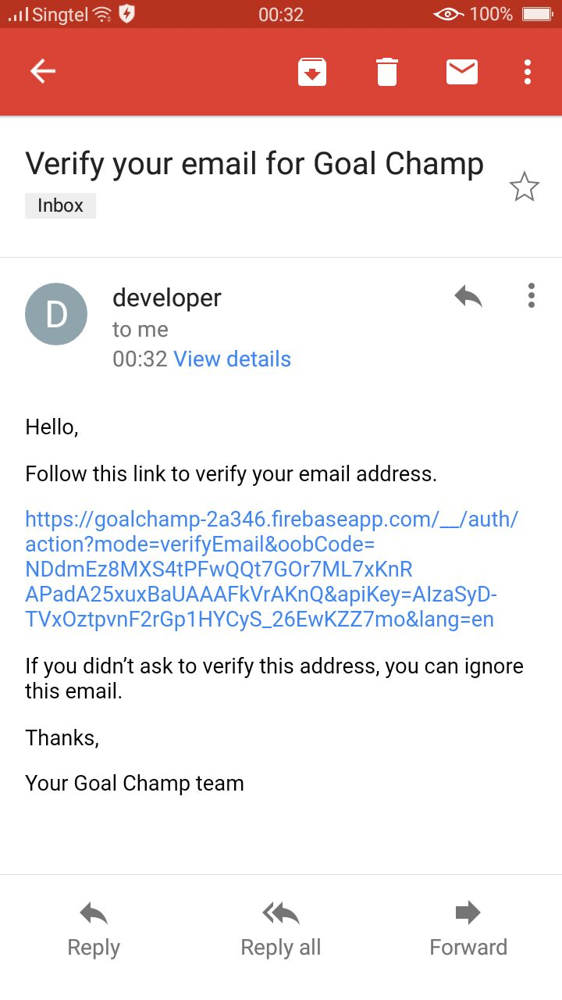
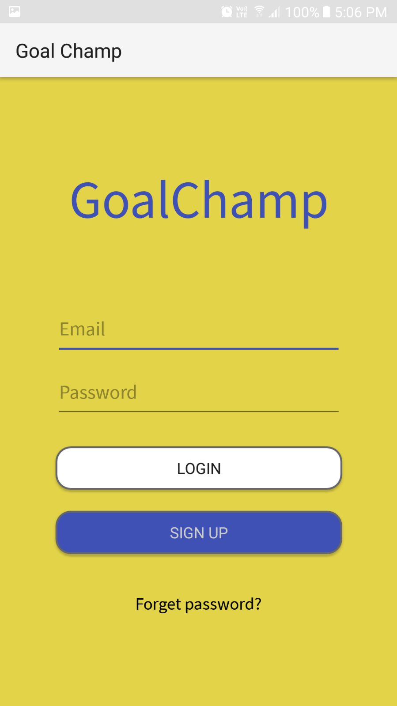
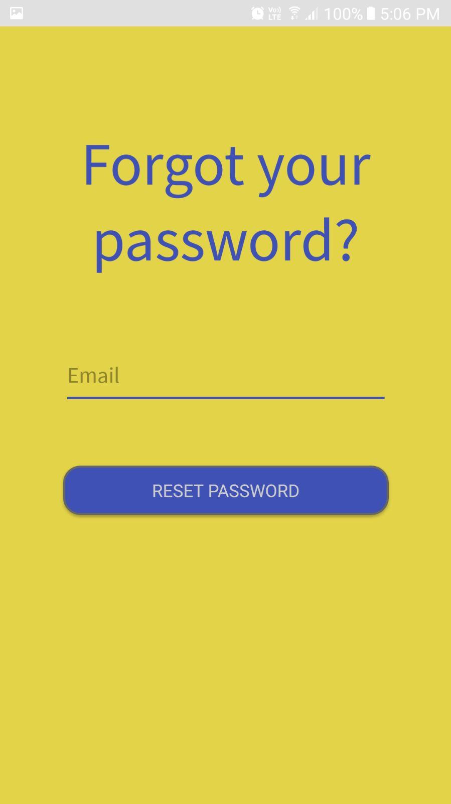
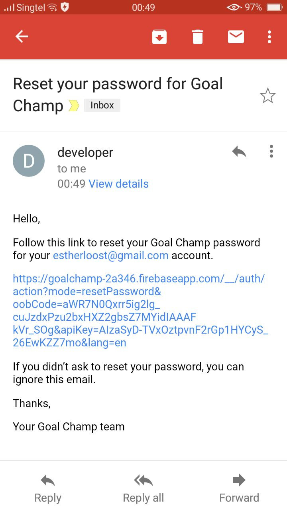
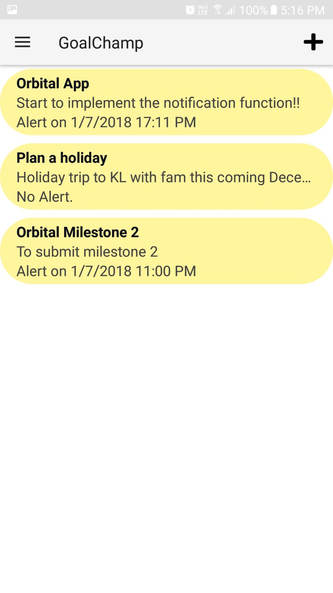
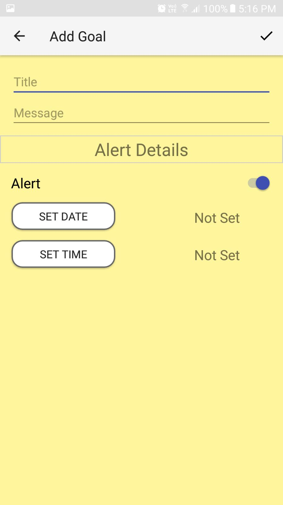
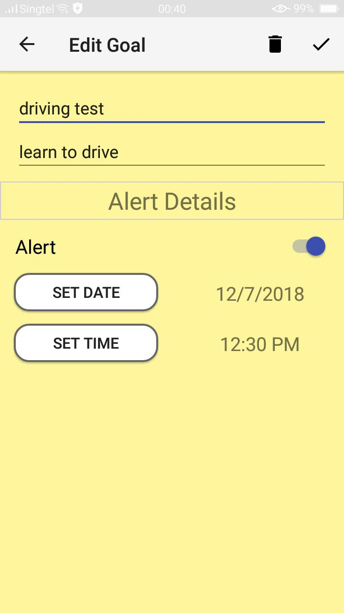
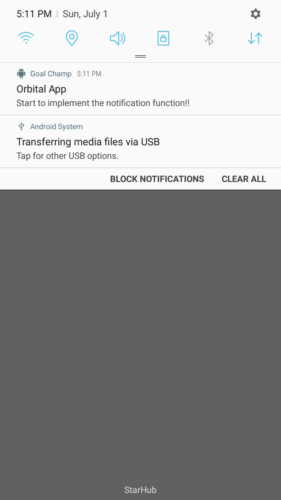

# Goal-Diggers
Group Member : Keith Tan Jia Wen , Khoo Jin Zheng Daniel    
Proposed Level of Achievement : Gemini

## Aim
We want to help people to accomplish their goals on time, motivating them and supporting them on their journey.

## Project Scope
We want to help people to achieve their desired goals on time by giving timely reminders and motivation for them to pursue their goals. On top of that, we want them to be able to share their goals with their friends and vice versa, so that they can send encouragement to one another as well. This additional support would assist them in accomplishing what they have set out to do.

## Motivation
Have you ever find it difficult to accomplish your goals? For example, starting revision early for your exams, submitting projects on time, eating healthy or exercising. We would tend to procrastinate or even forget about the goals that we wanted to achieve for ourselves. This can lead to undesirable consequences in the long run as these goals take a much longer time to complete or we set lower targets for ourselves instead.

## User Stories
1) As a user, I want to login via Email & Passwords so that I can access my personal profile. 
2) As a user, I want to be able to add my goals in the application so that I can keep track of them.
3) As a user, I want to be able to update my goals so that I can change it or set it as completed. 
4) As a user, I want to be able to delete my goals so that I can delete completed goals.
5) As a user, I want to be reminded of my goals so that I can accomplish it on time.
6) As a user, I want to be notified with a motivational quote so that I can stay motivated in accomplishing my goals.
7) As a user, I want to be able to share my goals with my friends and also motivate them in theirs so that we can achieved our goals together.

## Proposed Features
**User App**
1) Authentication - login/register feature for users 
2) Basic CRUD - users to create/read/update/delete goals
3) Push notification - send reminder to users about incomplete goals depending on the frequency that user has set (e.g. Every 3 days) 
4) Push notification - send motivational quote to users every monday of the week 
5) Able to share goal with friends

Features written above will be ranked according to priority, from 1 - 3. 1 being highest, 3 being lowest.   
Priority 1 ==> Features 1 - 3   
Priority 2 ==> Feature 4    
Priority 3 ==> Feature 5    
Therefore, features will be implemented according to their priorities to allow us to achieve the minimum viable product.    

**Technologies & Tools to be used**
1) Android Studio 
2) Firebase 

### **Milestone 1**
**Deliverables**  

***Project Log*** - [Access it here](https://docs.google.com/spreadsheets/d/1627yw5_XkMy7Iwnjxbx3gzkLc4e0jlNZPGXV5smlsdI/edit?usp=sharing)  
***Poster*** - [Access it here](https://drive.google.com/file/d/1QzX9UBhvEgfZ6lSxoRm_jCgvJX2uBxS3/view?usp=sharing)  
***Video*** - [Access it here](https://youtu.be/Sp5ttuiS3s0)  

### **Milestone 2**

**Deliverables**

***Project Log*** - [Access it here](https://docs.google.com/spreadsheets/d/1627yw5_XkMy7Iwnjxbx3gzkLc4e0jlNZPGXV5smlsdI/edit?usp=sharing)    
***Poster*** - [Access it here](https://drive.google.com/file/d/1DfBdkJ3xrJV9oEh5nUpNGEl-JmdwOjic/view?usp=sharing)  
***Video*** - [Access it here](https://youtu.be/XIU5FKDC84s)  

Proposed Level of Achievement : Gemini  

**Aim:**  
We want to help people to accomplish their goals on time and support them on their journey.

**Project Scope:**  
We want to help people achieve their desired goals on time whether the users have short-term or long-term goals, we want to assist them in completing it and fight procrastination.

**Problems encountered:**  
After the evaluation by our peers and advisor, we realized that we were trying to meet too many needs, helping users to accomplish their goals, motivating them and having peer support group for them. We decided to focus our aim on helping users to accomplish their goals by having a reminder app. However, things took another turn when we realized that there were already many mobile applications in the market and we struggled to make our product creative. As a result, we had to change the overall layout, plan and also our development.  

By Milestone 2, we have came up with the Minimum Viable Product for the User Application.  
**Core Features developed:**
1. Login
2. Signup, Email Verification
3. Forgot Password, Email Verification
4. Create goal, Set notification
5. Display goals
6. Update goal
7. Delete goal

**Features for the next phase:**
1. Searchbar - allow users to search within the application for all related goals based on keyword  
2. Display completed and incomplete goals separately - completed and yet to complete goals will serve as a motivation to work towards completing more goals  

### User App
> SignUp Screen

   

User will sign up with their email & password, a verification will be emailed to the user.

> Login Screen

  

Upon verification, User will then be able to login with Email & Password.

> Reset Password

   

User will receive an email with a link to reset the password.

> Home Page  

. 

User will be able to see all the goals set --> Title, Message & whether the alert notification is On/Off.

> Add Goal Page

  

User will be able to input the title, details of the goal and also user can choose to set alert notification On/Off.

> Edit Goal Page

  

User will be able to edit any mistake made in the details or also enable/disable the alert notification as well as delete this goal.

> Notification

  

An example of the notification the user will receive upon the Date/Time set by the user.
